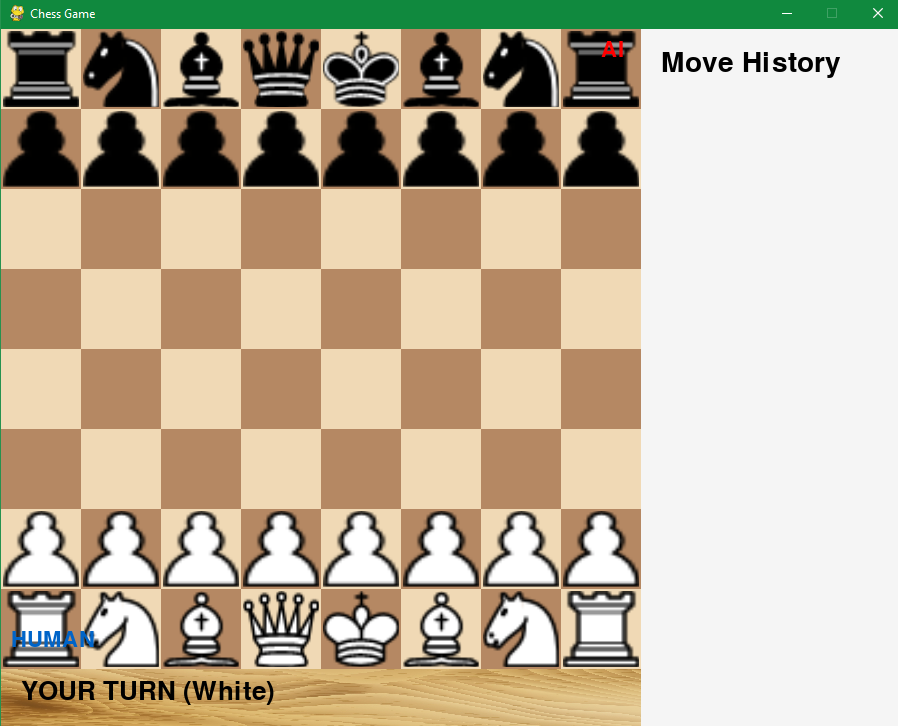
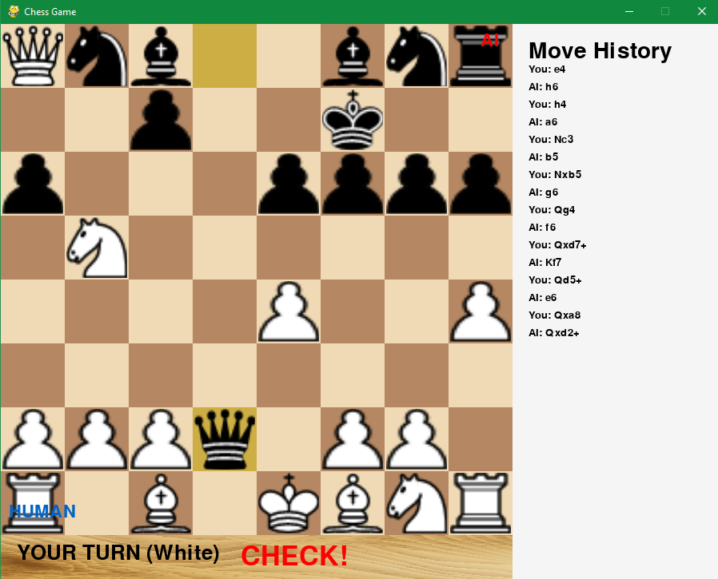

# Chess Game with AI

A fully-featured chess game with graphical interface and AI opponent, built with Python and Pygame.




## Features

- **Complete Chess Rules**: All standard chess rules including castling, en passant, and promotion
- **AI Opponent**: Intelligent chess bot with adjustable difficulty levels
- **Graphical Interface**: Clean, responsive PyGame interface with piece animations
- **Move History**: Complete record of all moves made in the game
- **Endgame Rules**: Custom 5-move rule for simplified endgames
- **Visual Highlights**: Legal moves, selected pieces, and last move highlighting
- **Check/Checkmate Detection**: Real-time game state monitoring
- **Promotion Menu**: Interactive piece promotion selection
- **Start/End Screens**: Professional game flow with result screens

## Installation

### Prerequisites
- Python 3.8 or higher
- Pygame 2.5.0 or higher

### Setup
1. Clone the repository:
```bash
git clone https://github.com/yourusername/chess-game.git && cd chess-game
```
2. Install required packages:
pip install -r requirements.txt

3. Run the game:
python app.py

## Project Structure
chess-game/
├── app.py                 # Main entry point
├── Chess_Game.py          # AI logic and bot implementation
├── Chess_GUI.py           # Graphical interface
├── requirements.txt       # Python dependencies
├── README.md              # This file
├── .gitignore            # Git ignore file
├── images/               # Game assets
│   ├── background.jpg    # Game background
│   ├── pawn-w.png        # White pawn
│   ├── pawn-b.png        # Black pawn
│   └── ...               # Other piece images

## How to Play
1. Launch the game using python app.py
2. Click the "PLAY" button on the start screen
3. You play as White, the AI plays as Black
4. Click on a piece to select it, then click where you want to move it
5. For pawn promotion, choose your desired piece from the menu
6. Try to checkmate the AI king!

## AI Difficulty
The AI bot has multiple difficulty levels:
1. Easy: Depth 2 search (fast moves, weaker play)
2. Medium: Depth 3 search (balanced speed and strength) - Default
3. Hard: Depth 4 search (stronger but slower)
To change difficulty, modify max_depth in Chess_Game.py line 12.

## Customization
### Changing Piece Images
Replace the PNG files in the images/ folder with your own. Images should be:
1. Transparent background (PNG with alpha channel)
2. Properly named (e.g., pawn-w.png, king-b.png)
3. Approximately 200x200 pixels for best results

### Changing Board Colors
Edit the color constants in Chess_GUI.py:
```bash 
self.WHITE = (240, 217, 181)   # Light squares
self.BROWN = (181, 136, 99)    # Dark squares
```

### Adjusting AI Speed
Modify the time limit in Chess_Game.py line 185:
```bash
return self.get_best_move_fast(board, time_limit=1.5)  # Adjust this value
```

## Features in Detail
### AI Implementation
The chess bot uses:
1. Minimax algorithm with alpha-beta pruning
2. Positional evaluation with piece-square tables
3. Move ordering for better performance
4. Iterative deepening with time limits
5. Simple opening book for early game

### Graphics Features
1. Smooth piece animations with easing
2. Highlighting of legal moves
3. Visual feedback for checks and checkmates
4. Responsive UI with clear turn indicators
5. Professional start and result screens

### Game Rules
1. Standard chess movement rules
2. Special moves: Castling, en passant, promotion
3. Check and checkmate detection
4. Stalemate and draw detection
5. Custom endgame 5-move rule

## License
This project is licensed under the MIT License - see the LICENSE file for details.

## Future Enhancements
### Planned features:
1. Multiple difficulty levels menu
2. Undo/Redo moves
3. Save/Load games (PGN/FEN)
4. Two-player (human vs human) mode
5. Chess clock/timer
6. Sound effects
7. Move hints/suggestions
8. Game replay feature


